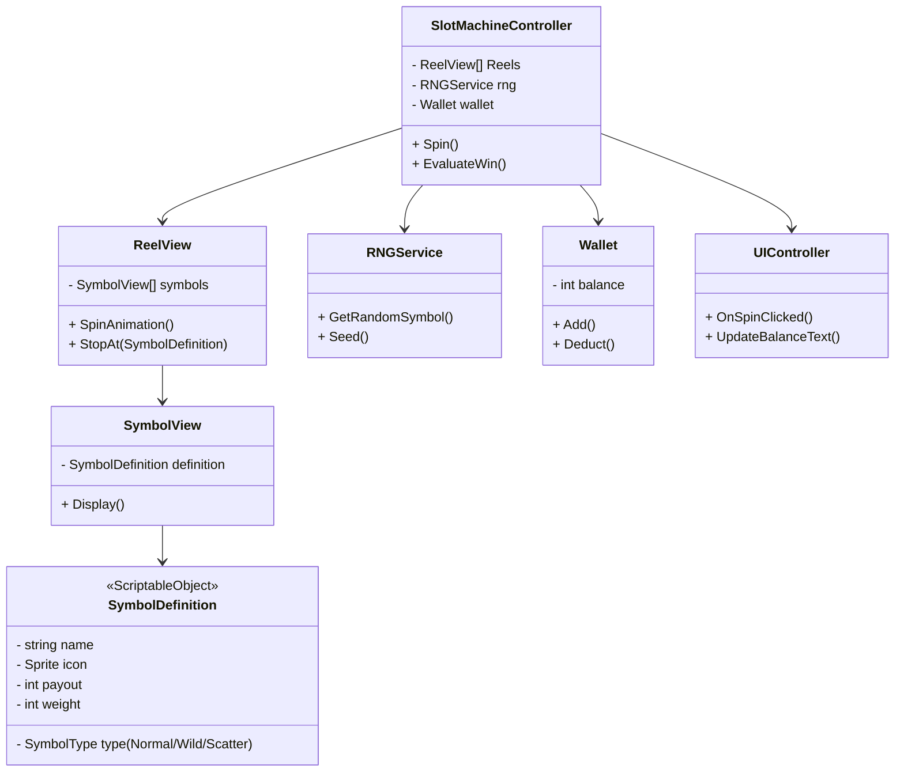

# Unity Slot Machine — Extended Version

A feature-rich slot machine built in Unity to demonstrate **clean structure, RNG fairness, animation, and bonus mechanics**.

---

## Play (WebGL)

* Open `Build/WebGL/index.html` locally via a static server.
* Or host the `/Build/WebGL` folder on **GitHub Pages** (see below).

---

##  Project Structure

```
Assets/
  Art/
  Audio/
  Prefabs/
    Reels/
    UI/
  Scenes/
    Main.unity
  Scripts/
    Core/
    Gameplay/
      Reels/
      Symbols/
      Features/
  UI/
  Build/
    WebGL/
```

---

##  Features

###  Core Gameplay

* **3×3 reel layout** with smooth spin animations
* **Win condition**: match symbols on paylines
* **Paylines**: 5 standard lines (3 rows + 2 diagonals)
* **Clean RNG** (crypto-seeded for fairness)
* **Configurable payouts** via ScriptableObjects
* **Balance system** with spin cost and payouts

### Bonus Features

* **Wild symbols** → substitute any match
* **Scatter symbols** → trigger **free spins** (3+ scatters)
* **Weighted rarity** → control symbol frequency
* **Animator option** → blur reel spin animations

### Extensibility

* Paylines easily expanded
* Free spins stackable
* Bonus features isolated in separate scripts
* Fully data-driven using ScriptableObjects

---

##  Scene & Prefab Setup (Step-by-step)

### Scene Hierarchy (Main.unity)

```
Canvas
  ├── UIController (scripts for spin button, balance text)
  ├── SpinButton
  └── BalanceText
SlotMachineController
  └── ReelContainer (empty parent)
       ├── ReelView_0
       ├── ReelView_1
       └── ReelView_2
AudioManager
```

### Prefabs

* **Symbol prefab** → Image + Symbol script
* **Reel prefab** → Empty with VerticalLayoutGroup, holds symbols
* **UI prefabs** → Button, Text

### Step-by-step Wiring

1. Create `Canvas` (UI Scale Mode: Scale With Screen Size).
2. Add **Spin Button** and **Balance Text**.
3. Create empty `SlotMachineController` GameObject → attach `SlotMachineController.cs`.
4. Inside it, create `ReelContainer` → add 3 child objects: `ReelView_0, ReelView_1, ReelView_2`.
5. Each ReelView prefab: attach `ReelView.cs`.
6. Create Symbol prefab: attach `SymbolView.cs`, link sprite in inspector.
7. Drag reels and symbols into controller references.
8. Link **Spin Button** → `UIController.OnSpinClicked()`.


---

## Unity .gitignore

Add a `.gitignore` in repo root:

```gitignore
[Ll]ibrary/
[Tt]emp/
[Bb]uild/
[Bb]uilds/
obj/
[Mm]emoryCaptures/
[Bb]in/
/Logs/
*.csproj
*.unityproj
*.sln
*.userprefs
.DS_Store
```

---

## 🛠 Editor Script (Auto-wire Reels)

Place in `Assets/Editor/AutoWireReels.cs`:

```csharp
using UnityEngine;
using UnityEditor;

[CustomEditor(typeof(SlotMachineController))]
public class AutoWireReels : Editor
{
    public override void OnInspectorGUI()
    {
        DrawDefaultInspector();

        SlotMachineController controller = (SlotMachineController)target;
        if (GUILayout.Button("Auto-Wire Reels"))
        {
            var reels = controller.GetComponentsInChildren<ReelView>();
            controller.Reels = reels;
            EditorUtility.SetDirty(controller);
            Debug.Log($"Wired {reels.Length} reels.");
        }
    }
}
```

---

## UML-style Class Diagram



---

##  Thought Process / Approach

* Started with **modular structure** (scripts split by domain: core, reels, symbols, features)
* Used **ScriptableObjects** for symbol definitions & payouts
* Centralized **RNGService** with cryptographic seeding
* Procedural **spin animation** with `AnimationCurve`
* Extended to **3×3 layout with paylines**, adding:

  * Wilds (flexible symbol match)
  * Scatters (bonus trigger)
  * Weighted rarity for symbol balancing
* Provided **Animator-driven option** for motion blur
* Ensured **WebGL compatibility**

---

## 📚 References

* [Unity ScriptableObjects](https://docs.unity3d.com/ScriptReference/ScriptableObject.html)
* [Unity UI Toolkit](https://docs.unity3d.com/Manual/UIElements.html)
* [AnimationCurve](https://docs.unity3d.com/ScriptReference/AnimationCurve.html)
* [Coroutines](https://docs.unity3d.com/Manual/Coroutines.html)
* [WebGL Build Settings](https://docs.unity3d.com/Manual/webgl-building.html)
* [Object Pooling](https://learn.unity.com/tutorial/introduction-to-object-pooling#)

---

